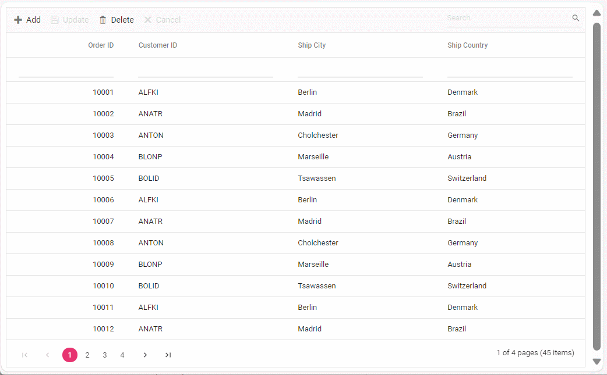

# Custom Adaptor in Syncfusion Vue Grid Component

The `CustomAdaptor`, which extends the `ODataV4Adaptor`, enables enhanced data handling capabilities while maintaining full compatibility with OData v4 services in the Syncfusion Vue Grid Component. This guide provides instructions on binding data and performing CRUD (Create, Read, Update, Delete) operations using the extended adaptor in your Vue Grid implementation.

## Getting Started

**1. Clone the Repository:**

Use `git clone` to fetch the repository from GitHub.

```bash
https://github.com/SyncfusionExamples/Binding-data-from-remote-service-to-vue-data-grid.git 
```

**2. Open and Build the Project:**

* Open the project in Visual Studio.
* Build the project to restore dependencies and compile it.
* Run the project

**3. Explore the Code:**

* Navigate to vue client folder(~src/app.vue)
* Debug and interact with the code as needed.



## Resources

You can also refer the below resources to know more details about Syncfusion Vue Grid components.

* [Demo](https://ej2.syncfusion.com/vue/demos/#/tailwind/grid/over-view)
* [Documentation](https://ej2.syncfusion.com/vue/documentation/grid/getting-started)
* [CustomAdaptor with Syncfusion DataManager](https://ej2.syncfusion.com/vue/documentation/grid/connecting-to-adaptors/custom-adaptor)