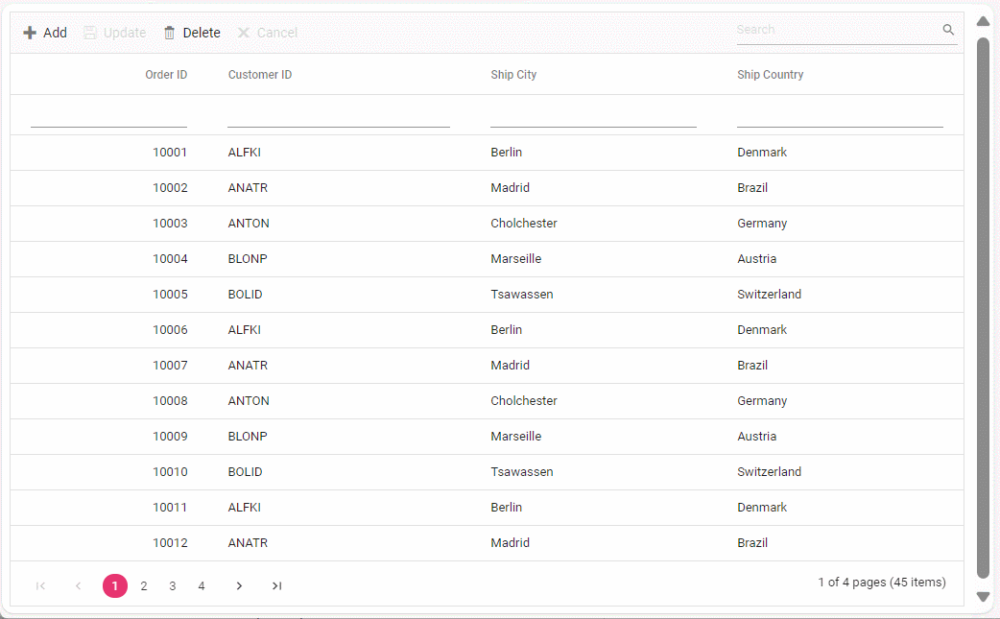

# Binding and perform CRUD operation using RemoteSaveAdaptor

The RemoteSaveAdaptor in Syncfusion Vue Grid Component allows you to perform grid actions such as sorting, filtering, searching and paging primarily on the client-side while handling CRUD operations, such as updating, inserting, and removing data, on the server-side for data persistence. This approach optimizes your experience by minimizing unnecessary server interactions.

## Getting Started

**1. Clone the Repository:**

Use `git clone` to fetch the repository from GitHub.

```bash
https://github.com/SyncfusionExamples/Binding-data-from-remote-service-to-vue-data-grid.git 
```

**2. Open and Build the Project:**

* Open the project in Visual Studio.
* Build the project to restore dependencies and compile it.
* Run the project

**3. Explore the Code:**

* Navigate to vue client folder(~src/app.vue)
* Debug and interact with the code as needed.



## Resources

You can also refer the below resources to know more details about Syncfusion Vue Grid components.

* [Demo](https://ej2.syncfusion.com/vue/demos/#/tailwind/grid/over-view)
* [Documentation](https://ej2.syncfusion.com/vue/documentation/grid/getting-started)
* [GraphQL with Syncfusion DataManager](https://ej2.syncfusion.com/vue/documentation/grid/connecting-to-adaptors/remote-save-adaptor)