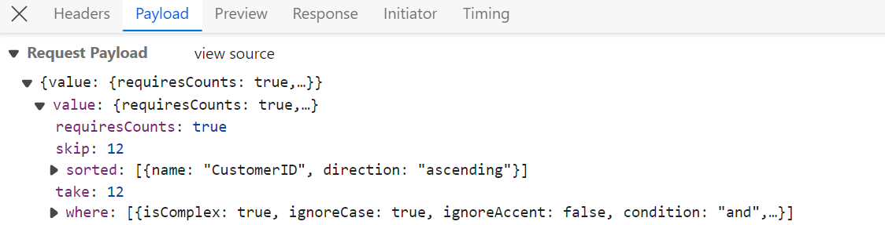

# WebMethodAdaptor in Syncfusion Vue Grid Component

The WebMethodAdaptor in Syncfusion Vue Grid facilitates data binding from remote services using web methods. This powerful feature enables efficient communication between the client-side application and the server. The WebMethodAdaptor, like the URL adaptor, sends query parameters encapsulated within an object named **value**. Within this **value** object, various datamanager properties such as **requiresCounts**, **skip**, **take**, **sorted**, and **where** queries are included.



This section describes a step-by-step process for retrieving data using WebMethodAdaptor, then binding it to the Vue Grid component to facilitate data and CRUD operations.

## Getting Started

**1. Clone the Repository:**

Use `git clone` to fetch the repository from GitHub.

```bash
https://github.com/SyncfusionExamples/Binding-data-from-remote-service-to-vue-data-grid.git 
```

**2. Open and Build the Project:**

* Open the project in Visual Studio.
* Build the project to restore dependencies and compile it.
* Run the project

**3. Explore the Code:**

* Navigate to vue client folder(~src/app.vue)
* Debug and interact with the code as needed.


## Resources

You can also refer the below resources to know more details about Syncfusion Vue Grid components.

* [Demo](https://ej2.syncfusion.com/vue/demos/#/tailwind/grid/over-view)
* [Documentation](https://ej2.syncfusion.com/vue/documentation/grid/getting-started)
* [WebMethodAdaptor with Syncfusion Grid](https://ej2.syncfusion.com/vue/documentation/grid/connecting-to-adaptors/web-method-adaptor)